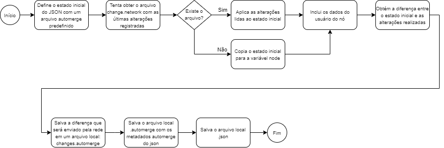

Automerge - Experimentando um CmRDT JSON Based
==============================================

O objetivo dessa prova de conceito é demonstrar o funcionamento do Automerge de forma incremental.

O [Automerge](https://github.com/automerge/automerge) funciona como um
commutative replicated data type, ou CmRDT, JSON based, ou seja, ele cria uma
estrutura de dados JSON armazenada em disco na forma de um arquivo de operações.

Workflow da POC:
-----------------------

Preparação do ambiente:
-----------------------

Os testes foram realizados em um Raspberry PI 2B rev 1.1 com 1GB de RAM
utilizando o Raspbian GNU/Linux 10 (buster) com os seguintes softwares:

-   Automerge 0.14.2

-   NodeJS v14.15.4
 

Uso
---

node automerge.js “numero do node de origem” “endereço e porta do node de
origem”.

*Exemplo:*

~~~~~~~~~~~~~~~~~~~~~~~~~~~~~~~~~~~~~~~~~~~~~~~~~~~~~~~~~~~~~~~~~~~~~~~~~~~~~~~~
node automerge.js 1 localhost:8330
~~~~~~~~~~~~~~~~~~~~~~~~~~~~~~~~~~~~~~~~~~~~~~~~~~~~~~~~~~~~~~~~~~~~~~~~~~~~~~~~

Será será gerado um json contendo as informações do node, e também as informações 
dos demais nodes compartilhados no arquivo changes.network (se existir)
